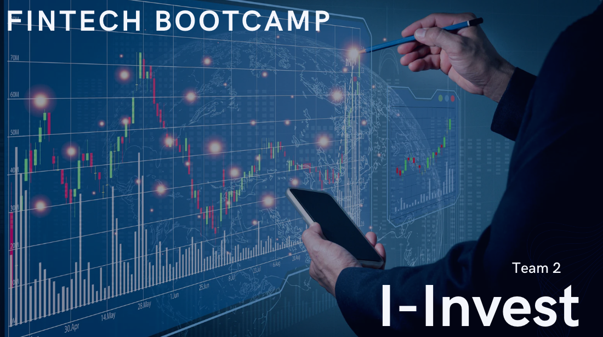
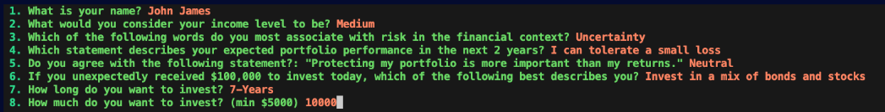
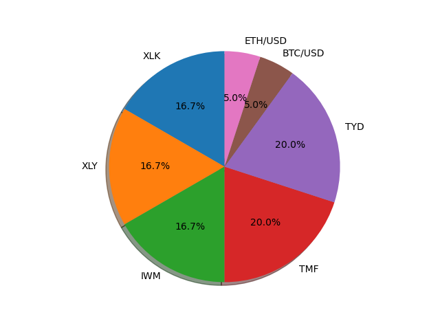
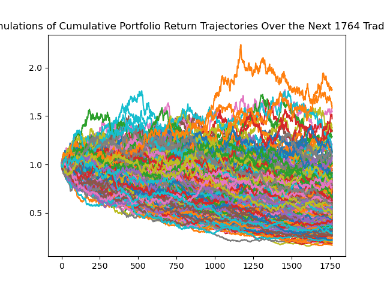
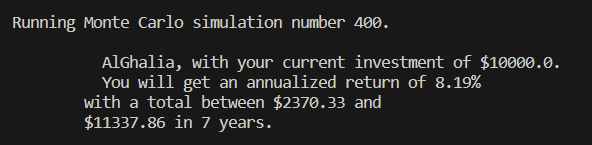

# I-invest App

I-invest is a python application that recommends to the user a portfolio based upon their risk tolerance.
Out of 11 ETF's stock & bonds sectors with 2 different cryptos I-invest will determine the best portfolio return based on the projected risk return methodology with the use of Monte Carlo simulation.

An individual will answers a questionnaire with a series of 8 questions to determine their risk tolerance.
Each question will have a certain weight that will be calculated at the end of the questioner.
The user will be asked for the username with expected time frame and the amount of investment.

#### User Questionnaire

The types are users risk tolerance and portfolio weights:  

**Aggressive**: User questionnaire results above 30 is categorized as a high risk investor. Aggressive risk investors are well versed with the market and take huge risks. 
Weights for aggressive investors would be 50% stocks and 40% bonds and 10% cryptos.  

**Moderate**:User questionnaire results between 20 and 30 is categorized as a moderate risk investor.  Moderate risk investors are relatively less risk-tolerant when compared to aggressive risk investors. 50% Stocks and 50% bonds  

**Conservative/Low**: User questionnaire results between 10 and 20 is categorized as a Conservative/Low risk investor. Conservative/Low risk investors take the least risk in the market
The portfolio that is generated will have different weights designed based upon our insight of their risk tolerance. 
Weights: 40% Stocks and 60% bonds  

---

## Data collection & assets allocation

- Data Collection: importing a 5 years closing price for the top performing ETFs in the market.
- Stock & Bonds ETF Asset allocation: with the use of 5 years historical beta to determine the level of risk of each ETF and assigns to the portfolio
- Crypto asset allocation : the optimal crypto in the market.

## Sources

Alpaca - https://github.com/alpacahq/alpaca-py 

## Output

- The user will get after submitting the questioner a pie chart with exact weights for his portfolio.
- The final output would be the projected return based on the Monte Carlo simulation.

#### High Risk Pie Chart

#### High Risk Simulation

#### High Risk Result

---

## Technologies

The program is based on Python 3 and require the following libraries/packages to function

- Fire
- Questionary
- Alpaca-py (API key is required for Alpaca access. Need to create an account)
- Pandas
- Numpy
- load_dotenv

---

## Installation Guide

The user of the application will have to download Python,   Python package manager PIP and Git.

   - [How to install Python](https://www.python.org/downloads/) 
   - [How to install PIP ](https://pip.pypa.io/en/stable/installation/) 
   - [How to install Git ](https://git-scm.com/book/en/v2/Getting-Started-Installing-Git) 
   
   Once you have installed Python and PIP, you can install Questionary and Fire packages 
   > pip install questionary  
   > pip install fire  
   

---

## Usage

To use the application, follow the steps below.

1. Download the files from Github
    > mkdir i-invest  
    > git clone https://github.com/nafeezurc/cu_fintech_t2_project1 
    > cd i-invest

2.  Create a .env file on the folder for the project and store the alpaca API keys
   > alpaca_api_key={key}
   > alpaca_secret_key={secret_key}
   
3. Run python app.py on terminal

---

## Contributors

This application is developed by Luis, Joe, Mario, AlGhalia, Naf

---

## License

Copyright: N/A

